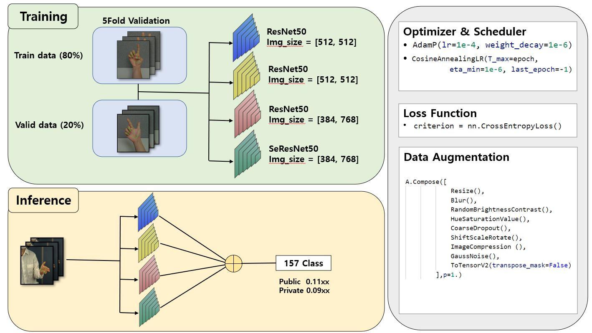

# Dacon2021-[Ego-Vision] 손 인식
## Overview


## Data Path
```
​```
${Motion_Folder}
├── train.py
├── main.py
├── utils.py
├── dataloader.py
|
├── pretrained
|   └── 512_1.pth
|   └── 512_2.pth
|   └── 384_768_1.pth
|   └── 384_768_2.pth
|
├── submission
|   └── final_dacon_submission.csv
|
├── data
|   └── sample_submission.csv (Dacon data)
|   └── hand_gesture_pose.csv (Dacon data)
|   └── train.csv (Our data after preprocessing)
|   └── test.csv (Our data after preprocessing)
|   
└── environment.yml
​```
```

## Environments Settings
- #### CUDA version >= 11.1
- #### Ubuntu 18.04
```
$ conda env create -n ego --file environment.yml
$ conda activate ego
$ pip install git+https://github.com/ildoonet/pytorch-gradual-warmup-lr.git
```

## Training & Save models
```bash
python main.py
```

## Inference & Make submission
```bash
python main.py --test
```

## Pretrained weights
* [pretrained_weights](https://drive.google.com/drive/folders/1DF78Y855yCuZ0V21JEI6qkcya4VyOzjl)
